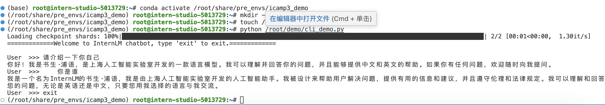
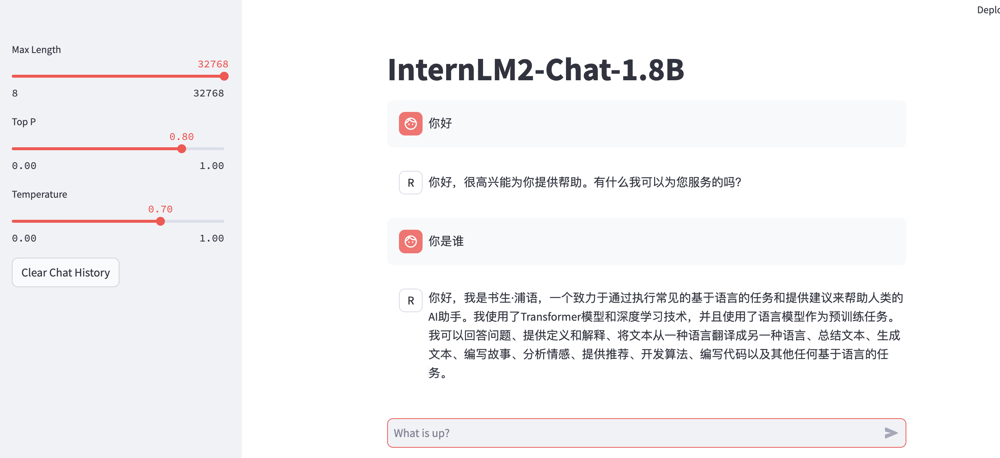

**该教程来源于[8G玩转书生大模型demo](https://github.com/InternLM/Tutorial/blob/camp3/docs/L1/Demo/easy_readme.md)**

##### 题目一：Cli Demo-InternLM2-Chat-1.8B 模型的部署

1. 启动开发机，并创建对应的环境（这里使用的是预先配置的环境，位于share/pre_envs路径下。
2. 构建对应代码，运行完成部署

以下是部署成功的效果图：

##### 题目二：Streamlit Web Demo-InternLM2-Chat-1.8B 模型的部署

1. clone项目到demo目录下
2. 启动一个 Streamlit 服务
3. 将端口映射到本地：ssh端口号可以查询ssh登录命令

以下是部署成功的效果图：
